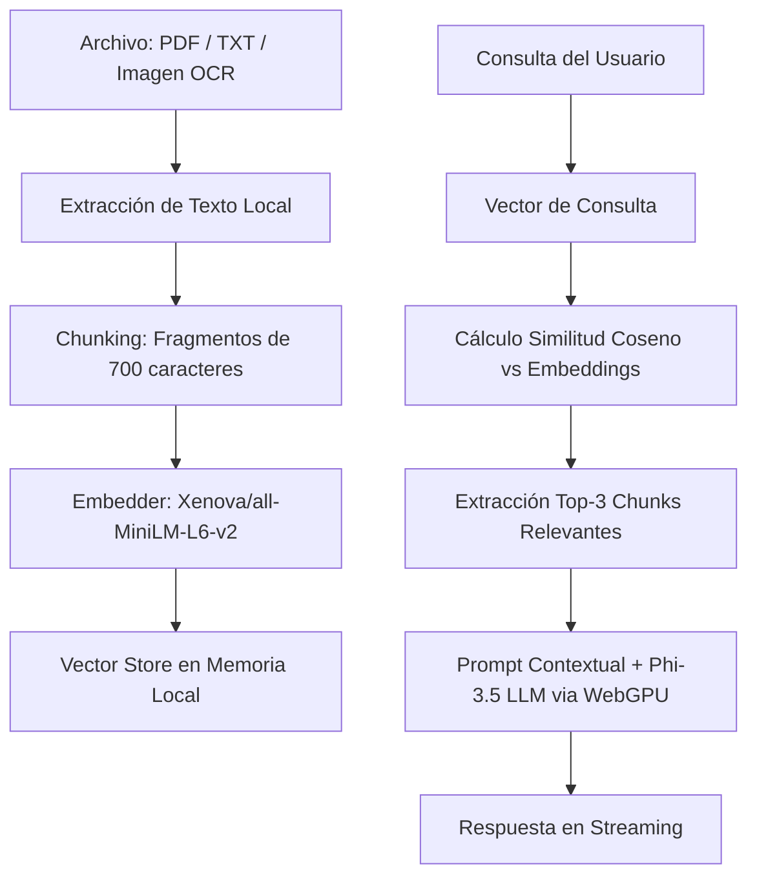

# ⚡ BOLSILLO IA/s • Local LLM & Edge RAG Engine

**BOLSILLO IA/s** "Tu IA privada que vive en tu dispositivo" es una plataforma WebApp client-side de última generación que ejecuta un Modelo de Lenguaje de Gran Escala (LLM) de parámetros cuantizados directamente en la **GPU local del navegador móvil** mediante WebGPU.
Aclaración Importante: Diseñado y calibrado exclusivamente para ejecutarse en la **GPU local de smartphones**
Procesamiento local: tus documentos y conversaciones no necesitan enviarse a un servidor para generar respuestas, al eliminar por completo la dependencia de servidores externos y APIs centralizadas, garantiza inferencia con latencia ultra baja, funcionamiento **100% offline después del primer inicio** y privacidad absoluta. Además, incluye un sistema RAG (Retrieval-Augmented Generation) vectorial local para procesamiento y consulta de documentos en tiempo real.

---
## 🌟 Virtudes y Capacidades Principales

- **Inferencia 100% On-Device:** El modelo corre directamente en la aceleración de hardware del usuario (WebGPU). Sin llamadas API, sin latencias de red y sin tarifas por token. Una vez descargado el modelo, la inferencia no requiere Internet!.

- **RAG Vectorial Client-Side (Vector DB Local):**

- Sistema de búsqueda semántica local que procesa documentos PDF, archivos TXT e imágenes mediante OCR. Los datos se fragmentan, vectorizan y consultan completamente en memoria local.
  
- **Operatividad Offline Garantizada:**

- Una vez descargados e indexados los pesos del modelo en la caché del navegador, la aplicación no requiere conexión a Internet.
  
- **Agentes Especializados (Personas):**

-  Configuración dinámicas de prompts de sistema enfocados en áreas clave: Matemáticas, Historia, Programación, Experto Global, Investigación, Análisis, Escritura, Educación, Ciencia, Seguridad, Negocios.

- **Accesibilidad Multimodal Integrada:**
- **OCR Local:**

- Reconocimiento óptico de caracteres para imágenes usando Tesseract.js en español.
  
- **Lector de Documentos:**

- Extracción nativa de texto para PDFs (`PDF.js`) y archivos `.txt`.

- **Text-To-Speech (TTS):**
    
- Sintetizador de voz nativo en español neutro (AR).
---
## 📱 Disponibilidad y Arquitectura Exclusiva para Smartphones

El desarrollo y las métricas de rendimiento de **BOLSILLO IA/s** fueron concebidos bajo un paradigma **Mobile-First / Smartphone-Only** (*Mobile Edge Computing*).

* **Aceleración Hardware On-Device:** Optimizado para el stack de procesadores móviles (Snapdragon, Dimensity, Apple Silicon) mediante la API WebGPU en navegadores móviles (Chrome / Kiwi / Edge en Android).
* **Gestión Térmica y VRAM Calibrada:** El esquema de fragmentación (*chunking* a 700 caracteres) y el límite de tokens activos (1000) están ajustados para prevenir el estrangulamiento térmico (*thermal throttling*) y evitar el cierre de pestañas por presión de memoria RAM/VRAM en el sistema operativo móvil.
* **UX Táctil e Interfaz Fluida:** Diseño responsivo *Touch-First* adaptado a pantallas verticales, con soporte nativo para carga de archivos desde el almacenamiento interno, vista rápida de fragmentos y sintesis de voz (*Text-To-Speech*).

---

## 🚀 Capacidades del Engine RAG

### 1. 📌 Trazabilidad Exacta (Source Attribution)
Garantiza precisión y elimina las alucinaciones del modelo al vincular cada afirmación con su origen físico dentro del documento.
* **Metadatos Inyectados:** Cada bloque procesado almacena el nombre del archivo (`filename`), índice de fragmento (`chunkIndex`) y un identificador único global (`docID`).
* **Verificabilidad Legal/Técnica:** El LLM redacta sus respuestas citando explícitamente la fuente o sección consultada (ej. `[ARCHIVO: "contrato.pdf" | SECCIÓN: doc_17892_chunk_7]`).

### 2. 📚 Soporte Multi-Documento Simultáneo (Multi-Document RAG)
Permite subir múltiples archivos de forma paralela sin perder rendimiento en la búsqueda.
* **Indexación en Vector Store Único:** Procesa contratos en PDF, documentos de texto plano (`.txt`) y capturas o imágenes analizadas vía OCR dentro de una misma base de datos vectorial unificada en memoria.
* **Consultas Cruzadas:** La búsqueda por similitud coseno cruza e integra en una sola respuesta fragmentos provenientes de distintos archivos.

### 3. 🧠 Recuperación Contextual Avanzada (Reconstrucción del Texto)
Supera el problema del texto cortado típico del fragmentado estático mediante un algoritmo de reconstrucción de contexto adyacente.
* **Expansion de Ventana:** Al encontrar un *match* semántico, el sistema extrae automáticamente el fragmento seleccionado junto con su bloque anterior (`chunkIndex - 1`) y posterior (`chunkIndex + 1`).
* **Coherencia Sintáctica:** Asegura que cláusulas, oraciones o tablas partidas por los límites de caracteres se reconstruyan completamente antes de ser enviadas al prompt del LLM.

### 4. 🗂️ Filtrado Específico por Metadatos
Cada fragmento indexado dentro del arreglo local cumple con una estructura estricta de metadatos.

---

## 🛠️ Arquitectura Técnica y Stack Tecnológico

| Componente | Tecnología / Librería | Función |
| :--- | :--- | :--- |
| **Aceleración Hardware** | WebGPU API | Aceleración gráfica por hardware directo dentro del navegador |
| **Motor LLM** | `@mlc-ai/web-llm` | Ejecución de inferencia de modelos cuantizados (Phi-3.5-mini-instruct-q4f16_1-MLC) |
| **Embeddings & Vector DB** | `@xenova/transformers` | Pipeline de extracción de características con `Xenova/all-MiniLM-L6-v2` |
| **OCR Local** | `tesseract.js` | Extracción de texto desde imágenes |
| **Procesamiento PDF** | `pdf.js` | Renderizado y extracción de texto página por página |
| **Parseo Markdown** | `marked` | Renderizado de código y formato en tiempo real |

---

## 🧠 Flujo del Sistema RAG Vectorial Local

---

### ​📄 Licencia:

Desarrollado con 💚 por <strong>Thaurock</strong>

