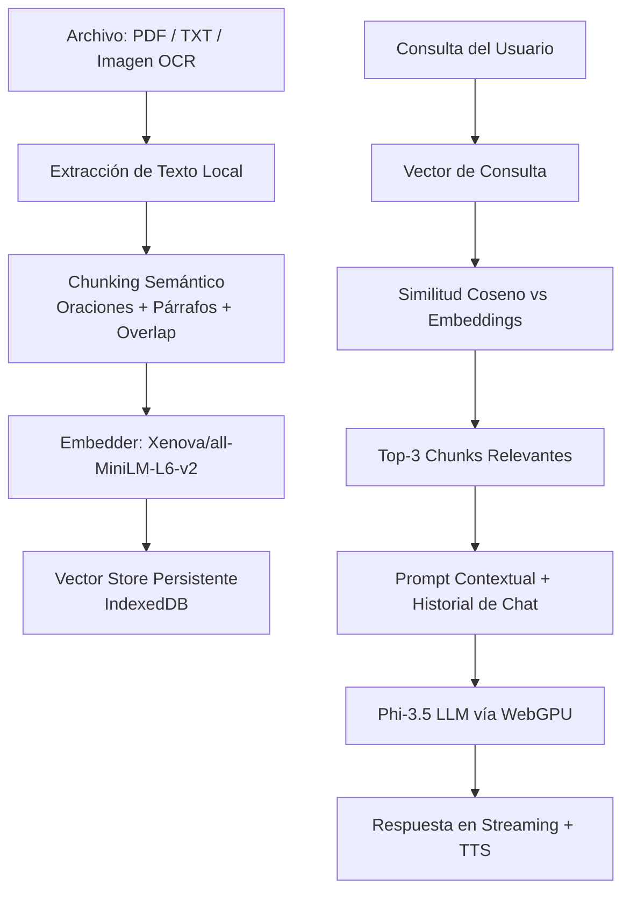

# ⚡ BOLSILLO IA/s • Local LLM & Edge RAG Engine

**BOLSILLO IA/s** — *"Tu IA privada que vive en tu dispositivo"* — es una plataforma WebApp client-side de frontera que ejecuta un Modelo de Lenguaje de Gran Escala (LLM) cuantizado directamente en la **GPU local del navegador móvil** mediante WebGPU.

> **Aclaración crítica:** Diseñado y calibrado exclusivamente para ejecutarse en la GPU local de smartphones.  
> No depende de servidores externos ni de APIs centralizadas. Una vez descargados los pesos, la inferencia y el RAG operan **100 % offline**.

---

## 🌟 Virtudes y Capacidades Principales

- **Inferencia 100 % On-Device**  
  El modelo corre en la aceleración de hardware del usuario (WebGPU). Sin llamadas API, sin latencia de red y sin costo por token. Después de la descarga inicial, no se requiere Internet.

- **RAG Vectorial Persistente (IndexedDB)**  
  Sistema de búsqueda semántica local que procesa PDF, TXT e imágenes (OCR). Los fragmentos se vectorizan y se almacenan de forma **persistente** en IndexedDB, sobreviviendo a recargas de página y cierres del navegador.

- **Chunking Semántico Avanzado**  
  En lugar de cortes rígidos por caracteres, el motor segmenta el texto por **oraciones y párrafos completos**, preservando entidades nombradas y coherencia contextual. Incluye overlap de oraciones entre chunks.

- **Memoria Conversacional Multi-Turno**  
  El motor recibe los últimos N turnos de la conversación, permitiendo referencias anafóricas naturales (“¿podés profundizar en lo primero que dijiste?”, “aplicá lo mismo al segundo caso”, etc.).

- **Operatividad Offline Garantizada**  
  Modelo + embeddings + vectores de documentos quedan cacheados localmente. La aplicación funciona sin conexión una vez inicializada.

- **Agentes Especializados (Personas)**  
  System prompts dinámicos orientados a: Matemáticas, Historia, Programación, Experto Global, Investigación, Análisis, Escritura, Educación, Ciencia, Seguridad y Negocios.

- **Accesibilidad Multimodal Integrada**
  - **OCR Local** → Tesseract.js (español)
  - **Lector de Documentos** → PDF.js + soporte nativo `.txt`
  - **Text-to-Speech** → Síntesis de voz nativa en español neutro (AR)

---

## 📱 Disponibilidad y Arquitectura Exclusiva para Smartphones

El desarrollo y las métricas de rendimiento de **BOLSILLO IA/s** fueron concebidos bajo un paradigma **Mobile-First / Smartphone-Only** (*Mobile Edge Computing*).

* **Aceleración Hardware On-Device**  
  Optimizado para el stack de procesadores móviles (Snapdragon, Dimensity, Apple Silicon) mediante WebGPU en Chrome / Kiwi / Edge (Android).

* **Gestión Térmica y VRAM Calibrada**  
  Chunking semántico (~800 caracteres efectivos), límite de 2000 tokens de salida y control de historial de conversación ajustados para minimizar *thermal throttling* y presión de memoria en dispositivos móviles.

* **UX Táctil e Interfaz Fluida**  
  Diseño *Touch-First* adaptado a pantallas verticales, con carga de archivos desde almacenamiento interno, indicadores visuales de indexación y síntesis de voz nativa.

---

## 🚀 Capacidades del Engine RAG

### 1. 📌 Trazabilidad Exacta (Source Attribution)
Cada respuesta del modelo cita explícitamente la fuente física del documento:

Esto reduce alucinaciones y aporta verificabilidad legal/técnica.

### 2. 📚 Multi-Documento + Persistencia IndexedDB
- Indexación de múltiples PDF, TXT e imágenes en una única base de datos vectorial local.
- Los vectores **persisten** entre sesiones gracias a IndexedDB.
- Consultas cruzadas entre documentos en una sola respuesta.

### 3. 🧠 Chunking Semántico + Overlap
- Segmentación por oraciones y párrafos completos (no por `slice` rígido).
- Overlap de oraciones entre chunks para no perder contexto en los bordes.
- Evita cortar entidades nombradas, cláusulas o definiciones a la mitad.

### 4. 🔄 Memoria Conversacional (Multi-Turn)
- El motor recibe los últimos **6 turnos** (configurable) de la conversación.
- Permite referencias anafóricas naturales y continuidad de razonamiento.
- El contexto RAG se inyecta solo en el turno actual, manteniendo el historial limpio.

### 5. 🗂️ Gestión de Memoria RAG
- Botón **📊** → muestra la cantidad de vectores actualmente almacenados.
- Botón **🗑️** → limpia completamente la base de datos vectorial (con confirmación).
- Funciones internas disponibles para borrado selectivo por `documentId`.

---

## 🛠️ Arquitectura Técnica y Stack Tecnológico

| Componente                  | Tecnología / Librería                  | Función                                      |
|-----------------------------|----------------------------------------|----------------------------------------------|
| **Aceleración Hardware**    | WebGPU API                             | Inferencia GPU directa en el navegador       |
| **Motor LLM**               | `@mlc-ai/web-llm`                      | Phi-3.5-mini-instruct-q4f16_1-MLC            |
| **Embeddings**              | `@xenova/transformers`                 | `Xenova/all-MiniLM-L6-v2`                    |
| **Vector Store Persistente**| IndexedDB                              | Almacenamiento local de embeddings + metadatos |
| **OCR Local**               | `tesseract.js`                         | Extracción de texto desde imágenes           |
| **Procesamiento PDF**       | `pdf.js`                               | Extracción página por página                 |
| **Parseo Markdown**         | `marked`                               | Renderizado en streaming                     |
| **Chunking**                | Algoritmo semántico propio             | Oraciones + párrafos + overlap               |
| **Memoria de Chat**         | Sliding Window (últimos N turnos)      | Contexto conversacional multi-turno          |

---

## 🧠 Flujo del Sistema RAG Vectorial Local (Actualizado)

---

## 🔒 Privacidad y Seguridad

Zero-Data Architecture: ningún documento, consulta ni embedding sale del dispositivo.

Sin telemetría: no se envían métricas ni logs a servidores externos.

Offline real: después de la descarga inicial del modelo, la aplicación no requiere conexión.

Datos bajo control del usuario: los vectores viven en IndexedDB del navegador y pueden borrarse en cualquier momento.

## 📄 Licencia
MIT License

Desarrollado con 💚 por Thaurock

Edge AI • Local-First • Privacy by Design
